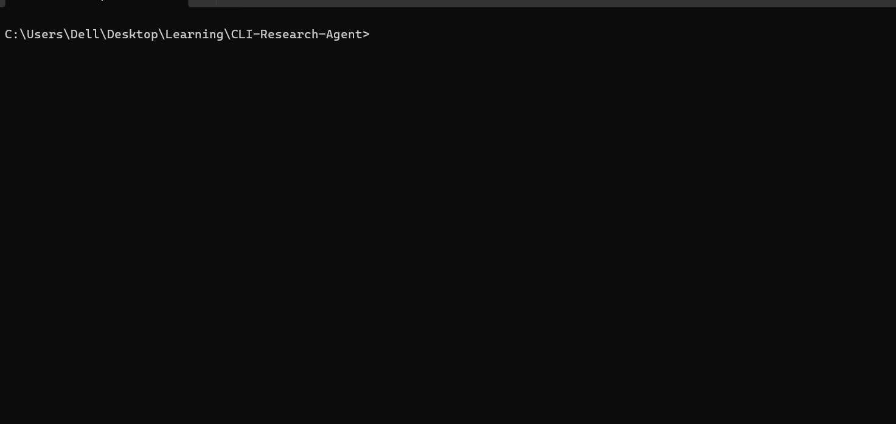

# CLI Research Agent

A terminal-based AI research agent built with Gemini + Tavily. Ask any question and watch it reason through multiple web searches, synthesize sources, and return a cited answer — all visible in real time.

Built as Project 01 of the [Agentic AI Engineer roadmap](https://github.com/yourusername).
## Demo


```

## Install

```bash
git clone https://github.com/yourusername/cli-research-agent
cd cli-research-agent

# Install uv if you haven't: https://docs.astral.sh/uv/
uv sync

cp .env.example .env
# Edit .env and add your API keys
```

Get your API keys:
- **GEMINI API KEY**: https://aistudio.google.com/ 

Select GET API KEY from the left side panel. Proceed with the required steps

- **Tavily** (free tier available): https://tavily.com

## Usage

```bash
# Basic query
uv run research ask "What is the current state of fusion energy?"

# More iterations for complex topics
uv run research ask "Compare US and European healthcare systems" --iterations 15

# Quiet mode (final answer only, no reasoning steps)
uv run research ask "Who founded OpenAI?" --quiet

# Help
uv run research --help
```

## Architecture

```
src/agent/
├── agent.py          # ReAct loop: thought → action → observation
├── streaming.py      # Rich terminal output
└── tools/
    ├── registry.py   # Tool schemas + dispatcher
    ├── web_search.py # Tavily web search
    ├── wikipedia.py  # Wikipedia lookup
    └── url_reader.py # Full page text extraction
```

The loop in `agent.py` is ~40 lines. The core idea: build a `messages` list, call Gemini with tool schemas, execute any tool calls, append results, repeat until `stop_reason == "end_turn"`.

## Run tests

```bash
uv run pytest tests/ -v
```

Tests use mocks — no API calls, no credits consumed.

## License

MIT
